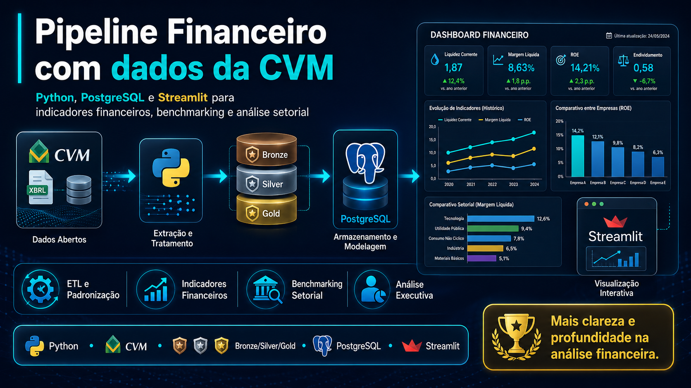

<p align="center">
  
</p>

<h1 align="center">Pipeline Financeiro com Dados da CVM</h1>

<p align="center">
  Engenharia de dados financeiros com Python, PostgreSQL e Streamlit, estruturada em arquitetura Bronze, Silver e Gold.
</p>

<p align="center">
  
  
  
  
  
</p>

## Visão geral

Este projeto transforma dados públicos da Comissão de Valores Mobiliários em uma base analítica estruturada para avaliação financeira de empresas brasileiras.

O pipeline percorre todo o fluxo, desde a ingestão dos demonstrativos brutos até a construção de indicadores, benchmarks e um dashboard executivo em Streamlit.

A empresa principal do estudo é a **COSAN S.A.**, comparada com:

- a mediana anual de todas as empresas da base;
- a mediana do setor **Agricultura (Açúcar, Álcool e Cana)**;
- outras empresas do mesmo setor por meio do **IPRF — Índice Preventivo de Risco Financeiro**.

## Problema de negócio

Os demonstrativos da CVM são públicos, mas não estão prontos para análise direta. Entre os principais desafios estão:

| Desafio | Tratamento aplicado |
|---|---|
| Múltiplas versões do mesmo documento | Deduplicação com `ROW_NUMBER()` |
| Diferenças na nomenclatura das contas | Normalização e mapeamento contábil |
| Contas ausentes ou incompletas | Reconstrução controlada de contas pai |
| Hierarquias contábeis inconsistentes | Validações matemáticas e semânticas |
| Granularidades diferentes | Uso de contas folha e regras de consolidação |
| Comparações entre empresas | Padronização anual e benchmark por mediana |

## Solução desenvolvida

A solução foi organizada em arquitetura Medallion:

```text
Portal de Dados da CVM
        ↓
      Bronze
        ↓
      Silver
        ↓
       Gold
        ↓
Dashboard executivo em Streamlit
```

### Bronze

Responsável pela ingestão e preservação dos arquivos originais.

- carregamento dos dados públicos da CVM;
- manutenção da estrutura bruta;
- rastreabilidade da origem;
- separação por demonstrativo e período.

### Silver

Responsável pela limpeza, padronização e auditoria.

- deduplicação dos documentos;
- padronização de colunas e tipos;
- normalização de nomes de contas;
- reconstrução controlada de contas pai;
- validações matemáticas;
- criação de flags de qualidade;
- organização de `BP`, `DRE` e `DFC`.

### Gold

Responsável pela camada analítica final.

- mart anual de indicadores financeiros;
- benchmark geral e setorial;
- views auxiliares para o dashboard;
- cálculo do IPRF;
- consolidação da análise da COSAN S.A.

## Principais entregas

- pipeline financeiro completo em arquitetura Bronze, Silver e Gold;
- tratamento dos demonstrativos `BP`, `DRE` e `DFC`;
- harmonização da taxonomia contábil da CVM;
- validação da hierarquia e dos saldos;
- cálculo de indicadores financeiros clássicos;
- comparação com medianas gerais e setoriais;
- score sintético de risco financeiro;
- dashboard executivo em Streamlit;
- documentação das regras de negócio e transformação.

## Indicadores analisados

O projeto contempla indicadores agrupados em cinco dimensões:

### Liquidez

- Liquidez Corrente;
- Liquidez Seca;
- Liquidez Imediata;
- Capital de Giro Líquido.

### Rentabilidade

- Margem Líquida;
- Margem Operacional;
- ROA;
- ROE.

### Solvência

- Endividamento Geral;
- Composição do Endividamento;
- Dívida Líquida;
- Cobertura de Juros.

### Eficiência operacional

- Giro do Ativo;
- Giro de Estoques;
- Prazo Médio de Recebimento;
- Prazo Médio de Pagamento;
- Ciclo Financeiro.

### Geração de caixa

- Fluxo de Caixa Operacional;
- Conversão de EBITDA em Caixa;
- Cobertura de Investimentos;
- Fluxo de Caixa Livre.

> No setor agrícola, a conta `1.01.05 — Ativos Biológicos` é considerada nos indicadores em que sua natureza econômica afeta a análise operacional.

## IPRF — Índice Preventivo de Risco Financeiro

O IPRF é um score criado para resumir a situação financeira da empresa em cinco dimensões:

1. Liquidez;
2. Rentabilidade;
3. Solvência;
4. Eficiência Operacional;
5. Geração de Caixa.

O índice permite posicionar a COSAN S.A. em relação aos pares setoriais e complementar a leitura dos indicadores tradicionais.

## Dashboard executivo

O dashboard foi desenvolvido em Streamlit e apresenta:

- visão consolidada da empresa;
- evolução histórica dos indicadores;
- comparativo com a mediana da base;
- comparativo com a mediana do setor;
- análise do IPRF;
- demonstrativos financeiros anuais;
- filtros e navegação interativa.

## Tecnologias utilizadas

| Categoria | Tecnologia | Aplicação |
|---|---|---|
| Linguagem | Python | Ingestão, transformação, análise e aplicação |
| Banco de dados | PostgreSQL | Armazenamento das camadas Bronze, Silver e Gold |
| Processamento | pandas | Limpeza, transformação e validação |
| Modelagem e conexão | SQLAlchemy e psycopg2 | Integração entre Python e PostgreSQL |
| Notebooks | Jupyter | Exploração e desenvolvimento |
| Dashboard | Streamlit | Interface analítica |
| Visualização | Plotly | Gráficos e comparações interativas |
| Configuração | python-dotenv | Gerenciamento de variáveis de ambiente |

## Estrutura do projeto

```text
big_data_for_finance/
├── notebooks/
│   ├── 01_bronze/
│   ├── 02_silver/
│   └── 03_gold/
├── queries/
├── dashboard/
│   ├── app.py
│   ├── config.py
│   ├── constants.py
│   ├── database.py
│   └── views/
├── assets/
├── requirements.txt
├── .env.example
└── README.md
```

## Como executar

### 1. Clone o repositório

```bash
git clone https://github.com/RenanDobriansky/Big-Data-for-Finance.git
cd Big-Data-for-Finance
```

### 2. Crie o ambiente virtual

```bash
python -m venv .venv
```

No Windows:

```powershell
.\.venv\Scripts\Activate.ps1
```

### 3. Instale as dependências

```bash
pip install -r requirements.txt
```

### 4. Configure as variáveis de ambiente

Crie um arquivo `.env` com base no `.env.example`:

```env
DB_HOST=localhost
DB_PORT=5432
DB_NAME=bigdata_for_finance
DB_USER=seu_usuario
DB_PASSWORD=sua_senha
```

### 5. Crie o banco e os schemas

```sql
CREATE DATABASE bigdata_for_finance;

CREATE SCHEMA IF NOT EXISTS layer_01_bronze;
CREATE SCHEMA IF NOT EXISTS layer_02_silver;
CREATE SCHEMA IF NOT EXISTS layer_03_gold;
```

### 6. Execute o dashboard

```bash
streamlit run dashboard/app.py
```

## Regras de qualidade

- não sobrescrever valores originais sem justificativa contábil;
- tratar a deduplicação antes das análises;
- preservar a rastreabilidade das transformações;
- respeitar a hierarquia das contas da CVM;
- evitar somas incorretas entre contas pai e filho;
- validar fórmulas sensíveis com amostras reais;
- manter credenciais fora do versionamento.

## Próximos passos

- adicionar capturas reais do dashboard;
- ampliar a cobertura de testes automatizados;
- documentar o dicionário completo de indicadores;
- automatizar novas cargas anuais da CVM;
- incluir novas empresas e setores no dashboard;
- disponibilizar uma demonstração pública da aplicação.

## Autor

**Renan Dobriansky**  
Analista de Dados | Power BI | SQL | Python | Engenharia de Dados

[LinkedIn](https://www.linkedin.com/in/renandobriansky/) • [GitHub](https://github.com/RenanDobriansky)

---

Projeto desenvolvido na disciplina de **Big Data for Finance**, da FAE Business School.